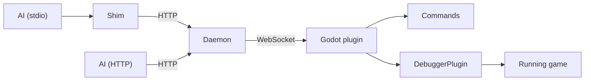

# Godot MCP — Claude Code Guidelines

## What This Is

MCP server + Godot 4.x plugin: 61 tools, 9 resources, WebSocket bridge. See [README.md](README.md) for full docs.

## Quick Reference

- **Owner**: `elfensky/godot-mcp` (Andrei Lavrenov)
- **npm**: `@elfensky/godot-mcp`
- **Build**: `cd server && npm install && npm run build`
- **Test server**: `cd server && npm test` (156 unit tests)
- **Test E2E**: `cd server && npm run test:e2e` (34 tests, requires running daemon + headless Godot)
- **Test plugin**: `godot --headless --script res://tests/test_plugin.gd` (43 tests)
- **Run**: `node dist/index.js --daemon` (HTTP server) or `node dist/index.js --project <path>` (shim → auto-starts daemon)

## Key Paths

- `server/src/index.ts` — entry point, CLI flags, daemon/shim routing
- `server/src/ports.ts` — deterministic port assignment (FNV-1a hash of project path)
- `server/src/daemon-discovery.ts` — .godot/mcp-daemon.json lifecycle
- `server/src/shim.ts` — stdio-to-HTTP proxy for stdio MCP clients
- `server/src/server.ts` — tool/resource registration, screenshot post-processing
- `server/src/bridge/` — WebSocket bridge + protocol types
- `server/src/tools/` — tool definitions (file, scene, script, project, asset, runtime, visualizer)
- `server/src/resources/` — resource definitions and URI routing
- `addons/godot_mcp/plugin.gd` — plugin lifecycle, auto-daemon, runtime autoload injection
- `addons/godot_mcp/mcp_client.gd` — WebSocket client with auto-reconnect
- `addons/godot_mcp/mcp_debugger_plugin.gd` — editor-to-game debugger bridge
- `addons/godot_mcp/mcp_runtime.gd` — game-side handlers (screenshots, overlays, perf stats)
- `addons/godot_mcp/commands/` — Chain of Responsibility command processors

## Architecture



- **HTTP daemon**: persistent process, multiple AI clients share one Godot connection
- **Stdio shim**: thin proxy for stdio-only clients (Claude Desktop), auto-starts daemon
- **Dynamic ports**: each project gets a unique port pair via FNV-1a hash of path (range 6505–8504)
- **Daemon discovery**: `.godot/mcp-daemon.json` written on startup, read by shims and plugins
- **Runtime tools** (`game_*`, visualizer): auto-inject `__MCPRuntimeBridge__` autoload before play

## Environment Variables

| Variable | Default | Description |
|----------|---------|-------------|
| `GODOT_MCP_PORT` | auto | WebSocket port (overrides hash-based assignment) |
| `GODOT_MCP_HTTP_PORT` | auto | HTTP port (overrides hash-based assignment) |
| `GODOT_MCP_TIMEOUT_MS` | 30000 | Tool call timeout |
| `GODOT_MCP_IDLE_TIMEOUT_MS` | 30000 | Daemon idle shutdown |
| `GODOT_MCP_SPAWNED_BY_DAEMON` | — | Set to `1` by daemon when spawning Godot (prevents plugin recursion) |

## Self-Recovery (when MCP tools are unavailable)

If the MCP server is disconnected and you have no Godot MCP tools available, bootstrap it manually:

```bash
# 1. Build (if needed)
cd server && npm run build

# 2. Start daemon + headless Godot (from repo root)
node server/dist/index.js --daemon --project "$(pwd)" &
```

Once the daemon is running, the MCP tools should reconnect automatically. If only Godot disconnected (daemon still running), use the `start_godot` MCP tool instead.

**Fallback testing without MCP**: `cd server && npm test` (unit) and `godot --headless --script res://tests/test_plugin.gd` (plugin) work without the MCP server.

## Adding Tools

1. Define schema in `server/src/tools/<domain>-tools.ts`
2. Register in `server/src/tools/index.ts`
3. Implement handler in `addons/godot_mcp/commands/<domain>_commands.gd`
4. Register processor in `commands/command_handler.gd`
5. Rebuild: `cd server && npm run build`

## Conventions

- **Tool results**: `{&"ok": bool}` + data or `{&"error": "msg"}`
- **Descriptions**: action-oriented, CAPS for constraints
- **Godot 4.6 compat**: don't use `:=` with dynamically-typed rhs (e.g. `Engine.get_meta()` chains) — use explicit types or `=`
- **Screenshots**: tools returning `path` field get post-processed to base64 `ImageContent` by server.ts
